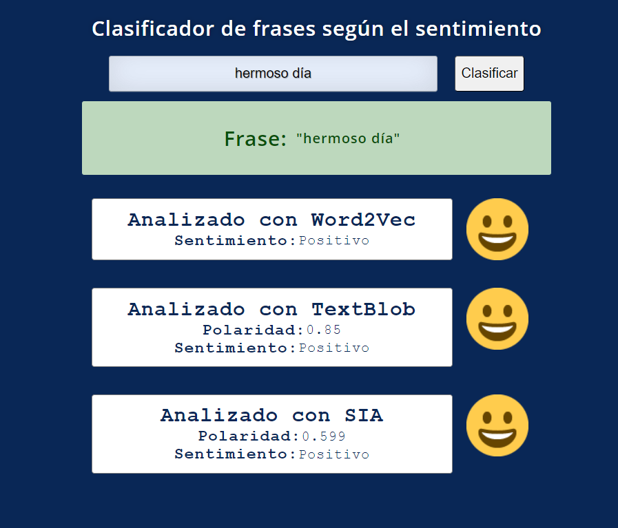

# CLASIFICADOR DE SENTIMIENTO
Cripto Predicción: Decisión y predicción de valor futuro de criptomonedas:

* @author: Lazarte, Julio

## Description
Es un proyecto de Data Science para clasificar frases según su sentimiento. La aplicación del proyecto se realizó con python: primero en google colab se entreno el modelo Word2Vec con el clasificador de textos Logistic Regression; luego de obtener el modelo y su clasificador se los guardó en la carpeta models/ del proyecto python, para ser utilizados directamente. Los datos de entrenamiento se tomaron de un dataset de Kaggle: https://www.kaggle.com/datasets conteniendo 1.6 mll de twits ya clasificados como positivos y negativos.

Además se utilizan otros dos métodos de clasificación:

- TextBlob: TextBlob es una librería de procesamiento de lenguaje natural (NLP) en Python que proporciona una interfaz sencilla para realizar tareas comunes de procesamiento de texto, como análisis de sentimientos, etiquetado de partes del discurso, traducción de idiomas, detección de idiomas y más. TextBlob está construida sobre NLTK (Natural Language Toolkit) y Pattern, que son otras dos librerías de NLP en Python.

-SIA: La librería SentimentIntensityAnalyzer, es una parte de la suite de VADER y se utiliza para calcular la puntuación de sentimiento de un texto en términos de positividad, negatividad y neutralidad. La puntuación se calcula en función de un diccionario léxico que contiene palabras con asignaciones de polaridad (positiva, negativa o neutral) y de fuerza (intensidad).

## Correr el proyecto
abrir app.py en VSC  y Ctrl+F5 o en el terminal: python app.py
luego abrir el local host indicado en el terminal